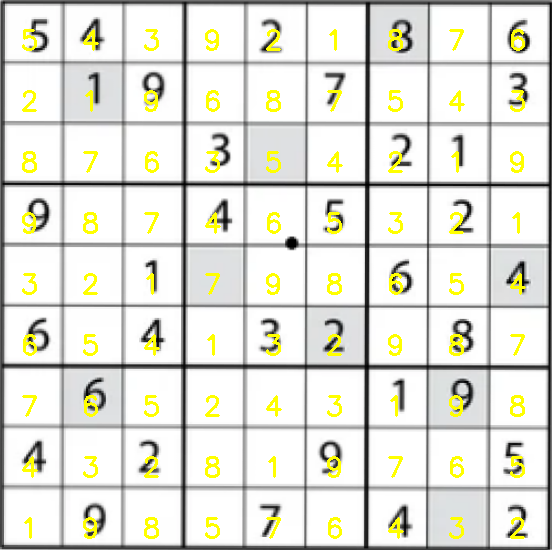

# SudokuSolver_using_Images

## Introduction

This project offers a comprehensive solution to solving Sudoku puzzles by harnessing the power of both image processing and machine learning techniques. Below are the key components of the project:

### Sudoku Solver Algorithm
This is the backbone of the project, responsible for solving a given Sudoku puzzle. The algorithm used here is backtracking, a classic method for solving constraint satisfaction problems like Sudoku. It fills in blank cells one by one, testing each option to see if it leads to a solution, and backtracks when it reaches an impasse.

### Find Puzzle
This section uses image processing techniques to locate and extract the Sudoku puzzle board from an input image. The algorithm employs contour detection methods in OpenCV to find the largest square in the image, which is presumed to be the Sudoku board. It then warps and crops this section for further processing.

### Extract Digit
After extracting the puzzle board, the next step is to extract individual digits from each cell of the board. The algorithm uses contour detection again to identify the digits. It ignores cells without numbers and prepares the rest for digit recognition.

### OCR of Sudoku Numbers
Optical Character Recognition (OCR) is employed to identify the digits in each cell of the Sudoku board. This is a critical step that translates the visual information into a format that can be understood and manipulated algorithmically.

### LeNet
The LeNet architecture, a pioneering convolutional neural network, is used for digit recognition. LeNet is particularly effective for tasks like handwritten digit recognition, making it well-suited for this project component.

By integrating these components, the project provides an end-to-end solution for solving Sudoku puzzles from images, starting from identifying the board to filling in the missing numbers.

## Requirements

To run this project, you'll need the following software and Python libraries installed:

- Python 3.x
- OpenCV: For image processing tasks like contour detection and image warping.
- NumPy: For numerical operations, especially for manipulating arrays and matrices.
- TensorFlow or PyTorch (Optional): If you are using neural networks like LeNet for digit recognition.
